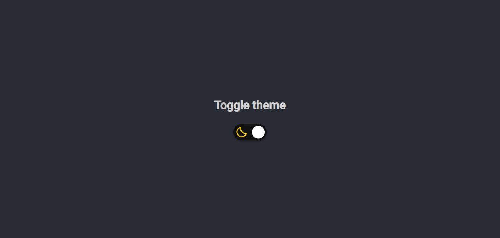

# Rocketseat-Toggle-theme

This is a challenge provided by Rocketseat to help begginers to improve coding skills, and reach the next level!
The challenge is to develop a page with a Light/dark theme switch,  But also i added a feature that the webpage remember the theme selected using localstorage.

## Screenshot

<h3 align="center">
  
</h3>

## Stack used

**Front-end:** HTML, CSS, Javascript

## Licença

[MIT](https://choosealicense.com/licenses/mit/)
